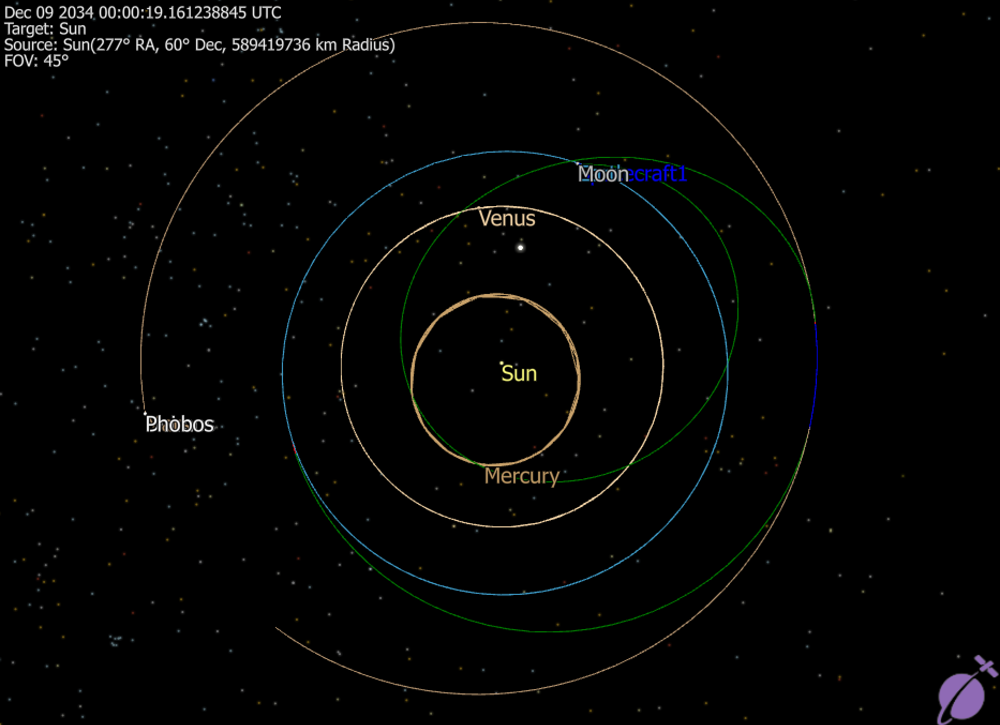

# Mars Mission Simulation
This FreeFlyer mission plan simulates a Mars mission leaving Earth in 2033, spending 30 days at Mars, and using a Venus gravity assist to return to Earth in 2034 (output shown below). Created as a final project for the AERO 423: Orbital Mechanics course at Texas A&M University.

